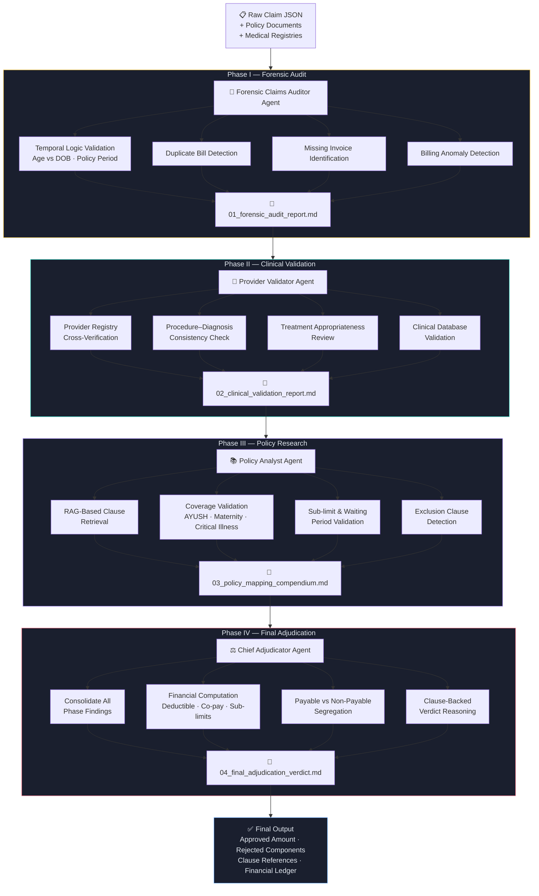

# ⚖️ Claims Adjudicator
### Agentic AI Accelerator for End-to-End Insurance Claim Adjudication

> Multi-agent AI framework automating the complete insurance claim lifecycle — from forensic validation to final financial verdict — with full explainability and audit traceability.


> 🔒 **This is a private repository.** Source code is not publicly accessible. This README documents the system architecture, capabilities, and business impact.

---

## 📌 Overview

Insurance claim adjudication is one of the most complex, dispute-prone, and manually intensive workflows in the healthcare payer ecosystem. Siloed validations, inconsistent documentation, and lack of explainability lead to delays, fraud exposure, and revenue leakage.

Claims Adjudicator is a **multi-agent AI accelerator** that automates and standardizes the complete adjudication lifecycle through four specialized, sequentially orchestrated agent phases — **Forensic Audit → Clinical Validation → Policy Research → Final Adjudication**. Each phase produces a structured, explainable audit artifact, ensuring full transparency, traceability, and compliance at every decision point.

---

## 💼 Business Problem

| Challenge | Impact |
|---|---|
| Inconsistent claim documentation | Manual re-review cycles and delays |
| Age / DOB mismatches and temporal errors | Invalid claims passing through undetected |
| Missing bills or invoice components | Incomplete adjudication and revenue leakage |
| Invalid or unverified provider registrations | Fraudulent claims approved |
| Clinical inconsistencies in procedures vs diagnosis | Medically inappropriate approvals |
| Policy clause misinterpretation | Incorrect payable calculations |
| Manual financial computations | Errors in deductibles, co-pay, sub-limits |
| Lack of explainability in verdict decisions | Disputes with no audit trail |

---

## ✅ What Claims Adjudicator Does

- Validates claim **structural integrity** — temporal logic, duplicates, missing invoices
- Cross-verifies **provider eligibility** and **clinical appropriateness** against medical registries
- Retrieves and applies **policy clauses** using RAG-based policy document intelligence
- Computes **payable vs non-payable** financial breakdown automatically
- Generates **4 structured markdown audit reports** — one per phase
- Delivers a **final adjudication verdict** with clause-backed reasoning and financial ledger
- Maintains complete **audit trail** for compliance and dispute resolution

---

## 🏗️ Agentic Workflow Architecture



---

## 🧱 Technical Stack

| Layer | Technology |
|---|---|
| **Agent Orchestration** | LangChain Agents / Custom Multi-Agent Framework |
| **Policy Retrieval** | RAG — FAISS + Sentence Transformers |
| **Clinical Validation** | Rule engine + LLM hybrid reasoning |
| **Forensic Logic** | Python rule-based validation + LLM |
| **Financial Computation** | Custom computation engine |
| **Output Format** | Structured Markdown, JSON |
| **Database Integration** | Provider registry DB, Clinical DB, Policy DB |
| **API Layer** | FastAPI |
| **Deployment** | On-premise / Private Cloud |

---

## 🎯 Four-Phase Agent Workflow

### Phase I — Forensic Audit
**Agent:** Forensic Claims Auditor
| Validation | Description |
|---|---|
| Temporal logic | Age vs DOB consistency, policy period checks |
| Duplicate detection | Identifies repeated bills or invoice entries |
| Missing invoice check | Flags incomplete billing documentation |
| Billing anomaly detection | Detects inflated or inconsistent charge patterns |

**Output:** `01_forensic_audit_report.md`

---

### Phase II — Clinical Validation
**Agent:** Provider Validator
| Validation | Description |
|---|---|
| Provider registry check | Verifies registration against `{registration_db}` |
| Clinical DB validation | Cross-checks procedures against `{clinical_db}` |
| Procedure–diagnosis alignment | Ensures billed procedures match diagnosis codes |
| Treatment appropriateness | Reviews clinical necessity of treatments |

**Output:** `02_clinical_validation_report.md`

---

### Phase III — Policy Research
**Agent:** Policy Analyst
| Validation | Description |
|---|---|
| RAG clause retrieval | Fetches exact policy clauses relevant to the claim |
| Coverage validation | AYUSH, Maternity, Critical Illness, Day Care etc. |
| Sub-limit identification | Maps benefit sub-limits to billed items |
| Waiting period check | Validates claim against applicable waiting periods |
| Exclusion detection | Flags any exclusion clauses that apply |

**Output:** `03_policy_mapping_compendium.md`

---

### Phase IV — Final Adjudication
**Agent:** Chief Adjudicator
| Step | Description |
|---|---|
| Findings consolidation | Aggregates all Phase I–III findings |
| Financial computation | Applies deductibles, co-pay, sub-limits |
| Payable segregation | Clearly separates approved vs rejected components |
| Clause-backed reasoning | Every decision cited against policy language |

**Output:** `04_final_adjudication_verdict.md`
- ✅ Approved amount
- ❌ Rejected components with reasons
- 📎 Clause references for every decision
- 💰 Structured financial ledger

---

## 📊 Business Impact

| KPI | Result |
|---|---|
| Claim Processing Time | **↓ 50–70% reduction** |
| Manual Review Effort | **Significantly reduced** |
| Claim Disputes | **Lowered via explainable decisions** |
| Fraud Detection | **Improved through multi-layer validation** |
| Audit Readiness | **Fully traceable, phase-by-phase** |
| Revenue Leakage | **Reduced** |

---

## 🔑 Key Differentiators

- **4-phase agentic workflow** — each agent specializes in one validation domain
- **Full explainability** — every decision traced to a clause, registry, or clinical rule
- **RAG-powered policy research** — no hardcoded rules, actual policy document intelligence
- **Hybrid reasoning** — rule-based logic + LLM for nuanced clinical and policy decisions
- **Structured markdown artifacts** — audit-ready output at every phase
- **End-to-end automation** — raw claim in, final verdict out, with complete audit trail

---

## 🚀 Deployment Model

```
┌──────────────────────────────────────────────────┐
│       Claims Adjudicator Deployment              │
│                                                  │
│  ✅ On-Premise / Private Cloud                   │
│  ✅ API-first integration                        │
│  ✅ Docker containerized                         │
│                                                  │
│  Secure Integrations:                            │
│  → Provider Registry Database                   │
│  → Clinical Validation Database                 │
│  → Policy Document Repository                   │
│  → Claims Management Systems                    │
│  → TPA & Payer Platforms                        │
│                                                  │
│  Audit Outputs (per claim):                      │
│  → 01_forensic_audit_report.md                  │
│  → 02_clinical_validation_report.md             │
│  → 03_policy_mapping_compendium.md              │
│  → 04_final_adjudication_verdict.md             │
└──────────────────────────────────────────────────┘
```

---

## 🔒 Privacy & IP Notice

This repository contains proprietary source code, agent orchestration logic, and enterprise insurance adjudication pipelines. The code, models, and workflow architecture are **not publicly accessible**.

If you are a recruiter, collaborator, or evaluator and would like a walkthrough or demo, please reach out:

📧 [paularpitaseis@gmail.com](mailto:paularpitaseis@gmail.com)
🔗 [LinkedIn — Arpita Paul](https://www.linkedin.com/in/dr-arpita-paul-575708135/)

---

## 👩‍💻 Author

**Arpita Paul** · Senior Data Scientist · GenAI & LLM Specialist
*From Seismology to GenAI 🚀 | NuSummit | Mumbai*

[](https://github.com/ArpitaAI-collab)
[](https://linkedin.com/in/yourprofile)
